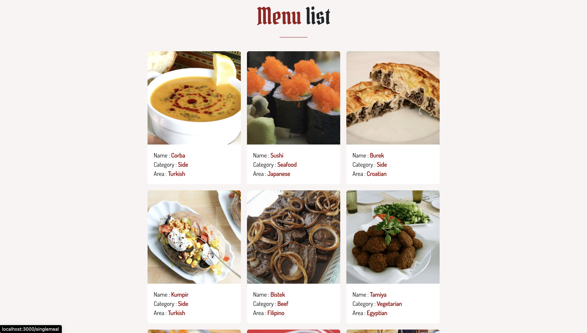

# Cooclicious Food Recipe Website

An integrated API website for many of food receipes and allow users for see each recipe details in separated page

# Api sources:

- https://www.themealdb.com/api/json/v1/1/search.php?s= for receipes

# About the website

The Cooclicious website includes the following pages:

- Home Page
- About us Page
- Menu page
- Gallery Page
- Detailed recipe Page
- Contact Page

# Technologies Used

- React
- Redux
- Bootstrap
- Material UI
- CSS

# Screenshots

# Project Link

https://cooclicious.vercel.app/
